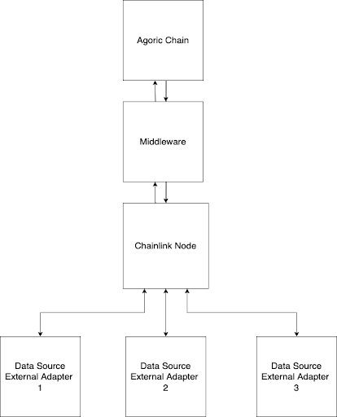

# Documentation

- [Oracle Network Structure](#oracle-network-structure)
- [Smart Contract Details](#smart-contract-details)
- [Aims/Objectives](#aims/objectives)
  - [Middleware](#middleware)
  - [Monitoring](#monitoring)
- [File structure](#file-structure)
- [Technical Documentation](#technical-documentation)
  - [helpers/chain.js](#chainjs)
    - [readVStorage(feed, roundData)](#readvstorage)
    - [getOffers(follower)](#getOffers)
    - [getLatestSubmittedRound(oracle)](#getLatestSubmittedRound)
    - [checkSubmissionForRound(oracle, feedOfferId, roundId)](#checkSubmissionForRound)
    - [queryPrice(feed)](#queryPrice)
    - [getOraclesInvitations(oracle)](#getOraclesInvitationsMiddleware)
    - [queryRound(feed)](#queryRound)
    - [pushPrice(price, feed, round, from)](#pushPrice)
  - [helpers/chainlink.js](#chainlinkjs)
    - [sendJobRun(count, jobId, requestType)](#sendJobRun)
  - [helpers/db.js](#dbjs)
    - [createDBs()](#createDBs)
    - [getAllJobs()](#getAllJobs)
    - [createJob(id, name)](#createJob)
    - [deleteJob(id)](#deleteJob)
    - [queryTable(table, fields, name)](#queryTable)
    - [updateTable(table, values, name)](#updateTable)
  - [helpers/utils.js](#helperjs)
    - [readJSONFile(filename)](#readJSONFile)
    - [saveJSONDataToFile(newData, filename)](#saveJSONDataToFile)
    - [delay(ms)](#delay)
    - [initialiseState()](#initialiseState)
    - [submitNewJob(feed, requestType)](#submitNewJob)
    - [checkIfInSubmission(feed)](#checkIfInSubmission)
    - [checkForPriceUpdate(jobName, requestType)](#checkForPriceUpdate)
  - [oracle/controller.js](#controllerjs)
    - [makeController()](#makeController)
  - [oracle/bridge.js](#bridgejs)
    - [startBridge(port)](#startBridge)
      - [POST /adapter](#postadapter)
      - [POST /jobs](#postjobs)
      - [DELETE /jobs/:id](#deljobs)
  - [oracle/middleware.js](#middlewarejs)
    - [Environment Variables](#envvarsmiddleware)
    - [middleware()](#middlewarefunc)
  - [oracle/monitor.js](#monitorjs)
    - [Environment Variables](#envvarsmonitor)
    - [Metrics](#metrics)
    - [readOracleAddresses()](#readOracleAddresses)
    - [readMonitoringState()](#readMonitoringState)
    - [getOraclesInvitations()](#getOraclesInvitations)
    - [updateMetrics(oracleName, oracle, feed, value, id, actualPrice, lastRound)](#updateMetrics)
    - [updateBalanceMetrics(oracleName, oracle, feed, value)](#updateBalanceMetrics)
    - [queryPrice(feed)](#queryPriceMonitor)
    - [getOffersAndBalances(follower, oracle)](#getOffersAndBalances)
    - [getLatestPrices(oracle, oracleDetails, state)](#getLatestPrices)
    - [startServer()](#startServer)
    - [monitor()](#monitorfunc)
- [Considerations](#considerations)
  - [Why not use a Chainlink cron job?](#consid1)
  - [Why does the middleware consist of an exposed API and two intervalled functions?](#consid2)
  - [Why does the middleware only consider the last few offers when making checks?](#consid3)
  - [Intervals](#consid4)
## Oracle Network Structure

</img>
<br>

Each node operator has to run:
- A Chainlink node hosted locally in Docker that queries <a href="https://docs.chain.link/chainlink-nodes/external-adapters/external-adapters/">Chainlink adapters</a>
- Chainlink adapters hosted beside the Chainlink node that act as middleware between the node as various 3rd party APIs
- Middleware which initiates jobs on the Chainlink node through its API if a round hasn't been created in 1 minute on the on chain aggregator contract. Rounds are also created if the oracle operator's current price is deviated past X% from the latest on-chain median price. Oracle operators are not allowed to create 2 rounds subsequently to prevent spamming.
- An Agoric node hosted on their own infrastructure to allow the middleware / oracle proxy to communicate and broadcast transactions reliably to the network.

Before making use of this middleware, oracles should prepare their setups using this <a href="https://github.com/jacquesvcritien/agoric-chainlink-setup-docs">setup guide</a>.

## Smart Contract Details

Smart Contract - https://github.com/Agoric/agoric-sdk/tree/8720d22ddf25a005aee25786bfa8ee4bccaf19c9/packages/inter-protocol/src/price

- The smart contract resembles a native Chainlink Solidity Flux-Monitor smart contract on Ethereum (Example - https://etherscan.io/address/0x79febf6b9f76853edbcbc913e6aae8232cfb9de9).
- For each feed, there will be a smart contract on chain and each node operator receives invitations to their smart wallet to be part of the oracle set. Then, oracles can use that invitation to push prices on chain.
- There is a minimum number of submissions which has to be reached in order for the on-chain price to be updated
- An oracle cannot initialise multiple consecutive rounds to avoid network congestion
- The updated price is the median from the submitted prices for a particular round
- Submissions for old rounds cannot be submitted and will be rejected

## Aims/Objectives

#### Middleware

The middleware is needed to:
1. Create CL jobs. CL jobs are created every minute. A cron job is not used in order to be able to pass in particular inputs to the job run so that the progress of the request can be stored and monitored.
2. Get price responses back from the CL node after Job requests are made from the middleware.
3. Query smart contract to see if submission period for a new round is open.
4. Submit a transaction to update prices on-chain.

The middleware should contain the following functionalities:

1. An SQLite database that allows the middleware to resume from its last execution whenever it is restarted.
2. An endpoint that listens for new and removed jobs from the CL node, allowing the middleware to maintain a list of jobs for which requests need to be sent.
3. Keep a list of active jobs in its state
4. Query the price on chain and the latest round every X seconds so that a new job request is created if a new round is found
5. Send CL job requests to the CL node with parameters including a request ID and the reason for the request every Y seconds. The reason can be one of the following 3 reasons:
    1. Type 1: Time expired and a new request have to be made
    2. Type 2: A price deviation from the on-chain price was found
    3. Type 3: A new round was found
6. An endpoint to listen for results from a CL job for submitted job requests. This endpoint should decide whether or not to push the price on chain. A price should be pushed on chain if one of the following cases is satisfied:
    1.  It is a new round and the oracle has not yet submitted to this round
    2. An interval of Z minutes/hours expired since the last price pushed on chain. **NOTE**: This is only done if the oracle has not started the previous round, as oracles are not allowed to start consecutive rounds.
    3. There is a deviation of more than W% from the current price on-chain. Once again, only done if the oracle has not started the previous round.
7. Keep the following information in the DB for each job in the jobs table

| Table Name 	| Field Name               	| Description                                                 	| Type   	|
|------------	|--------------------------	|-------------------------------------------------------------	|--------	|
| jobs       	| id                       	| The CL job's external id for that feed                      	| String 	|
| jobs       	| name                     	| The name of the feed                                        	| String 	|
| jobs       	| request_id               	| The last request id                                         	| Number 	|
| jobs       	| last_reported_round      	| The last reported round on chain                            	| Number 	|
| jobs       	| last_request_sent        	| The timestamp of the last price submission made on chain    	| Number 	|
| jobs       	| last_submission_time     	| The timestamp of the last request made to the CL node       	| Number 	|
| jobs       	| last_result              	| The last aggregated price on chain                          	| Number 	|
| jobs       	| last_received_request_id 	| The request id of the last result received from the CL node 	| Number 	|

8. Keep the following information in the DB for each job in the jobs table:

| Table Name 	| Field Name      	| Description                                        	| Type    	|
|------------	|-----------------	|----------------------------------------------------	|---------	|
| rounds     	| feed            	| The name of the feed                               	| String  	|
| rounds     	| round_id        	| Latest round id                                    	| Number  	|
| rounds     	| started_at      	| The timestamp when the round was started           	| Number  	|
| rounds 	    | started_by      	| The address who started the latest round           	| String  	|
| rounds 	    | submission_made 	| Whether a submission was made for the latest round 	| Boolean 	|

#### Monitoring

The monitoring script is needed to:
1. Monitor the actual price and that it is being updated
2. Monitor node operators' submissions to ensure they are submitting values within acceptable thresholds and that they are submitting to rounds and not missing them
3. Monitor node operators' balances to ensure they have enough balance for transaction fees to push prices on chain
4. Monitor the rate at which rounds are being created

The monitoring script should contain the following functionalities:

1. A state file which is updated so that whenever the monitoring script is restarted it is able to continue from where it was stopped.
2. Monitor multiple oracles at once
3. An endpoint to expose prometheus metrics which are a set of time-series data which can be graphed and used to monitor the whole oracle network.
4. Expose the following metrics
    1. The latest submitted value on chain by an oracle for a feed
    2. The timestamp in which an oracle made an on-chain submission for a feed 
    3. The last round for which an oracle made an on-chain submission for a feed
    4. The deviation of an oracle's submitted price from the latest aggregated value on-chain for a feed
    5. The oracle balance 
    6. The actual price on-chain
4. See all invitations IDs to be part of the oracle set from wallets
5. Query the latest prices and round submissions of oracles every X seconds and update the metrics
6. Have an efficient way of polling only the latest price pushes so be able to monitor oracles efficiently when the number of offers used start to increase


## File structure

In this section, one is able to find a description of the file structure and the contents of files

#### scripts

The scripts directory contains scripts which are used to for deployments. 

The following are the different scripts which can be found in this directory

1. accept-oracle-invitation.sh - This script can be used to accept an oracle invitation. This script takes in 3 parameters, the wallet name, the brand in and brand out. An example of a command to run this is ```./accept-oracle-invitation.sh $WALLET_NAME ATOM USD```. This requires the oracles to have provisioned a smart wallet as per the <a href="https://github.com/jacquesvcritien/agoric-chainlink-setup-docs">setup docs</a>.
2. provision-wallet.sh - This script can be used to provision a smart wallet. This script takes in one parameter, the wallet name. An example of a command to run this is ```./provision-wallet.sh $WALLET_NAME```. This requires oracles to have created a wallet as per the <a href="https://github.com/jacquesvcritien/agoric-chainlink-setup-docs">setup docs</a>.

#### config

This directory contains the following file:

1. <b>feeds-config.json</b> - This file contains the configuration for each feed in the oracle network. Each feed will have the following fields:
  - <u>pollInterval</u> - The interval in seconds which needs to pass between each CL job
  - <u>pushInterval</u> - The interval in seconds which needs to pass between each round creation on-chain
  - <u>decimalPlaces</u> - The number of decimal places allowed for the price
  - <u>priceDeviationPerc</u> - The price deviation percentage threshold on when to create a new round on-chain 
The file should have the following structure
```json
{
    "ATOM-USD" : {
        "decimalPlaces": 6,
        "pollInterval": 60,
        "pushInterval": 600,
        "priceDeviationPerc": 1 
    },
    "OSMO-USD" : {
        "decimalPlaces": 6,
        "pollInterval": 60,
        "pushInterval": 600,
        "priceDeviationPerc": 1 
    }
}
```

#### src

This directory includes all the source code. It is split into three other directories, <b>helpers</b>, <b>oracle</b> and <b>lib</b>.

Furthermore, it contains the following two files which serve as an entry point to the middleware and monitoring script:

* <b>bin-middleware.js</b> - This serves as an entry point to the middleware by calling the middleware() function
* <b>bin-monitor.js</b> - This serves as an entry point to the monitoring script by calling the getOraclesInvitations() and monitor() functions to first get the oracle invitation IDs and then starting the monitoring. 

##### helpers

This directory contains the following files:

1. <b>chain.js</b> - This file contains helper functions which are needed to interact with the Agoric chain
2. <b>chainlink.js</b> - This file contains helper functions to send job requests to the CL node
3. <b>db.js</b> - This file contains helper functions related to the database
4. <b>utils.js</b> - This file contains basic helper functions 
5. <b>MiddlewareEnv.js</b> - This file contains a class to represent the middleware's environment variables
6. <b>MonitorEnv.js</b> - This file contains a class to represent the monitoring script's environment variables
7. <b>logger.js</b> - This file exports a logger
8. <b>MonitoringState.js</b> - This file contains a class to represent the monitoring script's state and to interact with it
8. <b>MonitorMetrics.js</b> - This file contains a class to represent the monitoring script's metrics
8. <b>OracleMonitorConfig.js</b> - This file contains a class to represent the monitoring script's config 


##### oracle

This directory contains the following files

1. <b>bridge.js</b> - This file contains the NodeJS server which will listen to requests from the CL node
2. <b>controller.js</b> - This file contains the controller which will query the chain for rounds and prices
3. <b>middleware.js</b> - This file contains all the necessary code and functions for the middleware
4. <b>monitor.js</b> - This file contains all the necessary code and functions for monitoring the oracle network

##### lib

This directory contains files which I cloned from the <b>agoric-sdk</b> repository and these contain functions which are used in the middleware and monitoring script.

##### docker-compose.yml

This is a docker-compose file to spin up the middleware and monitoring script

##### Dockerfile.middleware

This is a docker file to build the middleware

##### Dockerfile.monitor

This is a docker file to build the monitoring script

##### monitoring-grafana-dashboard.json

This is a Grafana template to monitor an oracle node or the whole oracle network

## Technical Documentation

In this section, I will go over the <b>oracle</b> directory and explain in detail each function in the files inside it.


<div id='chainjs'></div>

### <u>helpers/chain.js</u>

<br>
<div id='readvstorage'></div>

<b>readVStorage(feed, roundData)</b>

Inputs:
* feed - The feed name
* roundData - A boolean indicating whether we are reading round data. A false means we are reading price data

Use: This function is used read price or round data from vstorage

Returns: CapDataString by calling vstorage.readLatest().

<br>
<div id='getOffers'></div>

<b>getOffers(follower)</b>

Inputs:
* follower - Follower object containing offers and balances. This is obtained by using Agoric's functions from agoric-sdk

Use: This function is used to get the latest offers from an address

Returns: The latest offer statuses from the last 5 entries in form of an array

What it does:
  1. Reverses all the offers and loops through the reversed array
  2. If it is an offer status and it does not have an 'error' property, it is added to the array to be returned
  3. Returns the array consisting of succeeded offers.

<br>
<div id='getLatestSubmittedRound'></div>

<b>getLatestSubmittedRound(oracle)</b>

Inputs:
* oracle - The address of the oracle of whom we are getting the latest submitted round

Use: This function is used to get the latest round for which a submission was made

Returns: The latest round ID for which a submission was made

What it does:
  1. Obtains a follower of offers and balances for the oracle address
  2. Gets the latest offers by calling <b>getOffers()</b> 
  3. Returns the round ID of the latest offer

<br>
<div id='checkSubmissionForRound'></div>

<b>checkSubmissionForRound(oracle, feedOfferId, roundId)</b>

Inputs:
* oracle - The address of the oracle
* feedOfferId - The ID of the feed offer
* roundId - The round ID to check the submission for

Use: This function is used to check whether an oracle submitted an observation for a particular round

Returns: A boolean indicating whether the oracle made a successful observation to the passed round id

What it does:
  1. Obtains a follower of offers and balances for the oracle address
  2. Gets the latest offers by calling <b>getOffers()</b> 
  3. Loops through the offers and does the following:
      1. Returns True if the offer is a 'PushPrice' offer, the feed offer ID matches to the inputted one and the offer has no error and has a matching round number.
      2. Returns False if it finds a successful 'PushPrice' offer with a round id smaller than the one passed as a parameter because a submission for an old round cannot be made. Since we are traversing offers started from the most recent one, if an offer for smaller round id is found, it is useless to continue looping as it is impossible to find an older offer for a more recent round.
  4. False is returned if the recent offers are traversed and no matching successful offer is found.


<br>
<div id='queryPrice'></div>

<b>queryPrice(feed)</b>

Inputs:
* feed - Feed name to query price for

Use: This function is used to query the latest on-chain price for a feed

Returns: The latest price

What it does:
  1. Reads the latest published price from vstorage using Agoric's functions from agoric-sdk
  2. Parses the value and returns it 
  3. If the above fails for some reason, -1 is returned. A reason for failing could be the first time a feed is created and there is no price on-chain yet
  

<br>
<div id='getOraclesInvitationsMiddleware'></div>

<b>getOraclesInvitations(oracle)</b>

Inputs:
* oracle - Oracle address to get invitations for

Use: This function is used to get the oracle invitation IDs for price feeds 

Returns: A JSON object with invitation IDs as below
```json
{
  "ATOM-USD": "123456789",
  "OSMO-USD": "987654321"
}
```

What it does:
  1. Loops through each oracle to monitor and obtain their invitation IDs for feeds
  2. The invitations IDs are returned in a JSON objects with the keys being the feed names and the values being the invitation IDs


<br>
<div id='queryRound'></div>

<b>queryRound(feed)</b>

Inputs:
* feed - Feed name to query round for

Use: This function is used to query the latest on-chain round for a feed

Returns: The latest round in an object containing the round ID, the timestamp when it was started, who started it and whether a submission was made by the oracle running this middleware using the FROM environment variable. The result object has the following structure
```json
{
  "round_id": 1,
  "started_at": 1612345678,
  "started_by": "agoric123456789",
  "submission_made": false
}
```

What it does:
  1. Reads the latest published round from vstorage using Agoric's functions from agoric-sdk
  2. Parses the values for round ID, started timestamp and who started the round
  3. Calls <b>checkSubmissionForRound</b> to check whether the oracle address running this middleware submitted to this round
  4. Appends all the details to an object and returns it


<br>
<div id='pushPrice'></div>

<b>pushPrice(price, feed, round, from)</b>

Inputs:
* price - The price to push
* feed - The feed to push the price to
* round - The round to push the price to
* from - The oracle address from where to push the price

Use: This function is used to push a price on chain for a specific feed and round

Returns: A boolean indicating whether the push submission was successful or not

What it does:
  1. Creates an ID for the offer. The ID is a timestamp
  2. Obtains the feed offer id from the wallet using <b>getOraclesInvitations()</b>
  3. Creates an offer object with the feed offer id, the created id, the price and the round
  4. It checks whether a submission for this round was already made to avoid double submissions to save transaction fees.
  5. Check if the middleware is waiting for a price submission confirmation using checkIfInSubmission()
  6. If a submission is not yet made and it is not waiting for a submission confirmation, it will loop for a maximum of SUBMIT_RETRIES and it will do the following:
      1. Queries the latest round
      2. Confirms whether the round we are submitting to is actually the latest round and that we have not sent a submission for this round yet
      3. If the above condition is satisfied, the offer is pushed on chain
      4. It will delay for SEND_CHECK_INTERVAL. This is done to ensure that the price is not still in the mempool and that two blocks (13 seconds in this case) have passed just in case.
      5. Check whether the submission was successful. If the submission was not successful after 2 blocks, the loop continues for next try.
      6. Once the loop finishes and all the tries were done, true or false will be returned indicating whether the price was successfully pushed or not


<div id='chainlinkjs'></div>

### <u>helpers/chainlink.js</u>

<br>
<div id='sendJobRun'></div>

<b>sendJobRun(count, jobId, requestType)</b>

Inputs:
* count - The request id
* jobId - The job id to send the request to
* requestType - The type of request. The request can have the following 3 values:
  - 1 - Time interval expired. This serves a cron and depends on <b>pollInterval</b>(for that feed)
  - 2 - Price deviation trigger. There was a price deviation greater than <b>priceDeviationPerc</b>(for that feed) between the new and previous on-chain prices
  - 3 - A new round was found on-chain

Use: This function is used to send a job request to the job on CL node. If it fails, it retries for a maximum of SUBMIT_RETRIES (defined in environment variables).

What it does:
  1. Reads the credentials from CREDENTIALS_FILE
  2. Creates the request by appending the request id and the request type
  3. It loops for a maximum of SUBMIT_RETRIES and tries to submit the job to the CL node


<div id='dbjs'></div>

### <u>helpers/db.js</u>

This file contains helper functions which are used to update state in the DB.

The file contains the following functions:

<br>
<div id='createDBs'></div>

<b>createDBs()</b>

Use: This function is used to initialise the required tables in the DB

What it does:
  1. Creates the required tables if they do not exist using db.exec()

<br>
<div id='getAllJobs'></div>

<b>getAllJobs()</b>

Use: This function is used to get all the jobs in the DB

Returns: An array of jobs

What it does:
  1. Uses db.all() to return all the jobs in the jobs table

<br>
<div id='createJob'></div>

<b>createJob(id, name)</b>

Inputs:
* id - This external job ID of the new CL job
* name - This name of the feed

Use: This function is used to add a new job to the DB and initialise its state.

What it does:
  1. Creates a record in the jobs table using db.exec()
  2. Creates a record in the rounds table using db.exec()

<br>
<div id='deleteJob'></div>

<b>deleteJob(od)</b>

Inputs:
* id - This external job ID of the new CL job

Use: This function is used to delete a job from the DB

What it does:
  1. Removes the job from the jobs and rounds table using db.exec()

<br>
<div id='queryTable'></div>

<b>queryTable(table, fields, name)</b>

Inputs:
* table - The table name to query
* fields - The fields to obtain
* name - The name of the field to query the appropriate feed

Use: This function is used to query either the jobs or rounds table

Returns: An object containing the record in the DB for the given field

What it does:
  1. Builds the SQL query and queries the DB using db.get(). This function is used because we always will need only 1 record. Hence, no need for db.all().

<br>
<div id='updateTable'></div>

<b>updateTable(table, values, name)</b>

Inputs:
* table - The table name to update
* values - A JSON object where the properties would be the column names and the values would be the values to set
* name - The name of the field to update the appropriate feed

Use: This function is used to query either the jobs or rounds table

Returns: An object containing the record in the DB for the given field

What it does:
  1. Builds the SQL command and updates the DB using db.exec().

<div id='helperjs'></div>

### <u>helpers/utils.js</u>

This file contains helper functions which are used both by the middleware and the monitoring script.

The file contains the following functions:

<br>
<div id='readJSONFile'></div>

<b>readJSONFile(filename)</b>

Inputs:
* filename - This is the file name or path to the file from which to read

Use: This function is used to read a JSON object from a file

Returns: The JSON contents in the file

What it does:
  1. Reads the file
  2. Parses the contents to a JSON variable
  3. Returns the variable containing the JSON object or array

<br>
<div id='saveJSONDataToFile'></div>

<b>saveJSONDataToFile(newData, filename)</b>

Inputs:
* newData - This is the JSON data to save
* filename - This is the file name or path to the file where to save data

Use: This function is used to save a JSON object/array to a file

What it does:
  1. Stringifies the data
  2. Writes the data to the file

<br>
<div id='delay'></div>

<b>delay(ms)</b>

Inputs:
* ms - Milliseconds to delay

Use: This function is used to create a delay

Returns: A Promise with a delay of a specified number of milliseconds


<br>
<div id='initialiseState'></div>

<b>initialiseState()</b>

Use: This function is used to initialise the state by creating the necessary tables in the DB

What it does:
  1. Creates the tables in the DB using the function createDBs()


<br>
<div id='submitNewJob'></div>

<b>submitNewJob(feed, requestType)</b>

Inputs:
* feed - The feed to submit a new job request for
* requestType - The request type to send as a parameter with the job request. 1 if a timer request, 2 if triggered by a price deviation, 3 for a new round.

Use: This function is used to send a job request to the CL node

What it does:
  1. Gets the latest request ID from the DB
  2. Increments the request ID
  3. Updates the 'last_request_sent' timestamp to the current timestamp in the DB
  4. Calls <b>sendJobRun</b> to send a job request to the CL node


<br>
<div id='checkIfInSubmission'></div>

<b>checkIfInSubmission(feed)</b>

Inputs:
* feed - The feed to check if a submission was made

Use: This function is used to check if the middleware is still waiting for a price submission confirmation

Returns: A boolean indicating whether last submission was made in less than SEND_CHECK_INTERVAL seconds

What it does:
  1. Gets the time of the last price submission from the DB
  2. Calculates the number of seconds passed from the submission
  3. Returns whether the number of seconds passed exceed SEND_CHECK_INTERVAL

<br>
<div id='checkForPriceUpdate'></div>

<b>checkForPriceUpdate(jobName, requestType, result)</b>

Inputs:
* jobName - The job name or feed for which we want to check
* requestType - The requestType of the price received from the CL node
* result - The price received from the CL node

Use: This function is used to check if a price update should be made on chain after receiving a price from the CL job

Returns: A boolean indicating whether a price update should be made on chain

What it does:
- Checks whether the following criteria is satisfied:
  - SEND_CHECK_INTERVAL seconds passed from the last price push update to ensure that multiple price updates are not pushed simultaneously
  - If it is a new round and we the oracle has not started the current on-chain round or if it is not a new round but the oracle has not submitted to the current round on-chain
  - One of the following:
    - If its time for a price update by comparing the timestamp of the last round and now by making use of <b>pushInterval</b>(for that feed) (Request type 1)
    - If there is a price deviation greater than <b>priceDeviationPerc</b>(for that feed) between the received price and the latest price on chain (Request type 2)
    - If there was a new a new round (Request type 3)

<br>
<div id='bridgejs'></div>

### <u>oracle/bridge.js</u>


<br>
<div id='startBridge'></div>

<b>startBridge(port)</b>

Inputs:
* port - The port to listen on

User: This function is used to start a server which listens to requests for a job addition, a job removal and a new job result. This server should serve the following endpoints:
1. <b>POST /adapter</b> - to get a job result from a CL node
2. <b>POST /jobs</b> - to get a new job addition from a CL node
3. <b>DELETE /jobs/:id</b> - to get a job removal from a CL node

What it does:

<div id='postadapter'></div>

a. <u>/adapter</u>: This is the endpoint which is used to accept job results from CL job requests. This endpoint does the following:
  - Read the result, request ID, request Type and job name from the received body
  - Check if an actual result was received and if not return a status 500 response. If a result is received, a 200 is sent as response.
  - Obtain the last price on-chain from the DB
  - Obtain the round to push the price for by checking whether the latest round on-chain is greater than the oracle's last reported round. If so, the round ID would be the latest round on chain. Otherwise, the latest round on chain is incremented by 1 as a new round would need to be created.
  - Checks whether a price update should be submitted on chain by calling checkForPriceUpdate()
  - Update the 'last_reported_round' and the request ID of latest job result received from CL node in the DB
<div id='postjobs'></div>

b. <u>/jobs</u>: This is the endpoint which is used to handle a new job created on the CL node. This endpoint adds the job to the jobs table in the DB.

<div id='deljobs'></div>

c. <u>/jobs/:id</u>:  This is the endpoint which is used to handle a job removal on the CL node. This endpoint removes the job from the DB.

<br>
<div id='controllerjs'></div>

### <u>oracle/controller.js</u>

<br>
<div id='makeController'></div>

<b>makeController()</b>

Use: This function serves as the controller for the middleware and it basically consists of two intervals running separately. One is triggerred every second and it is used to create a CL node job once this timer triggers. The other is triggered every BLOCK_INTERVAL and it is used to query the latest price and round stored on-chain. The latter will check if there is a price deviation or a new round and if so, a new CL job request is sent to the CL node

What it does:
  1. Creates an interval using setInterval to trigger every second. This will go through every job in the state and creates a CL job for each job depending whether the <b>pollInterval</b> for that feed expired.
  2. Creates a second interval using setInterval to trigger every BLOCK_INTERVAL. This will do the following:
      1. Reads the jobs from the DB
      2. Loops through all the jobs
      3. For every job it does the following:
          - Queries the price on-chain
          - Queries the round on-chain
          - Update the latest price and round in the DB for that job
          - If there is a new round and a submission is already made for that round, the 'last_reported_round' is updated in the DB. Otherwise, if a submission is not made, a new CL job request of type 3 is prepared
          - It will check for a price deviation from the previous on-chain price and if there is a price deviation greater than <b>priceDeviationPerc</b>(for that feed), a new CL job request of type 2 is prepared
          - If one of the above conditions is met and a CL job request is prepared, a final check is made. <b>This is done to avoid creating duplicate CL job requests resulting in extra subscription costs for oracles</b>. The CL job request is ONLY sent if one of the following conditions is met:
            1. There is no pending CL job request for which we are still waiting for. This is done by comparing the request ID of the last request sent and received from the DB.
            2. An interval of SEND_CHECK_INTERVAL passed from the last CL job request which was sent.


<br>
<div id='middlewarejs'></div>

### <u>oracle/middleware.js</u>

This file contains all the functions which are used by the middleware. 

<br>
<div id='envvarsmiddleware'></div>

<b>Environment Variables</b>

This script makes use of the following environment variables.

| Variable Name        	| Description                                                                                                                                                          	| Default value              	|
|----------------------	|----------------------------------------------------------------------------------------------------------------------------------------------------------------------	|----------------------------	|
| PORT                 	| The port on which the middleware will listen <br>for job updates or results from the CL node                                                                         	| 3000                       	|
| EI_CHAINLINKURL      	| The CL node URL in order to connect to its API<br>to listen for jobs and send job requests.<br><b>Note that this has no default value and needs<br>to be defined</b> 	| N/A                        	|
| FROM                 	| The address of the oracle from which to push prices.<br><b>Note that this has no default value and needs<br>to be defined</b>                                        	| N/A                        	|
| SUBMIT_RETRIES       	| The number of retries to try when submitting a price<br>on-chain and it fails                                                                                        	| 3                          	|
| BLOCK_INTERVAL       	| The block time of the chain in seconds. This is used<br>to query the price and round at every interval.                                                              	| 6                          	|
| SEND_CHECK_INTERVAL  	| The interval in seconds which is waited between each send.                                                                                                           	| 45                         	|
| AGORIC_RPC           	| The Agoric's node RPC endpoint                                                                                                                                       	| http://0.0.0.0:26657       	|
| STATE_FILE           	| The path to the middleware state's file                                                                                                                              	| data/middleware_state.json 	|
| CREDENTIALS_FILE     	| The path to the file containing the credentials to the <br>CL node                                                                                                   	| config/ei_credentials.json 	|


The CREDENTIALS_FILE should contain a JSON object containing the credentials to communicate with the CL node as can be seen below
```json
{
  "EI_IC_ACCESSKEY": "",
  "EI_IC_SECRET": ""
}
```

<br>
<div id='middlewarefunc'></div>

<b>middleware()</b>

Use: This function is used as entry to the middleware functions

What it does:
  1. Initialises state
  2. Starts the bridge to listen for new jobs and job results
  3. Starts the controller on the first second of the next minute. This is done to try and have all middleware pushing jobs on approximetely the first second of each new minute

<br>
<div id='monitorjs'></div>

### <u>oracle/monitor.js</u>

This file contains all the functions which are used by the monitoring script. 

<br>
<div id='envvarsmonitor'></div>

<b>Environment Variables</b>

This script makes use of the following environment variables and it requires them in order to function. In fact, it contains validation upon entry to make sure they are well defined.

| Variable Name 	| Description                                                                       	| Default value              	|
|---------------	|-----------------------------------------------------------------------------------	|----------------------------	|
| PORT          	| The port on which the monitor will serve metrics                                  	| 3001                       	|
| POLL_INTERVAL 	| The interval in seconds which needs to pass between<br>each price and round check 	| 10                         	|
| AGORIC_NET    	| Agoric's chain ID                                                                 	| N/A                        	|
| AGORIC_RPC    	| The Agoric's node RPC endpoint                                                    	| http://0.0.0.0:26657       	|
| STATE_FILE    	| The path to the monitoring state's file                                           	| data/monitoring_state.json 	|
| ORACLE_FILE   	| The path to the file containing the oracles to monitor                            	| config/oracles.json        	|


The ORACLE_FILE should contain a JSON array containing the oracles to monitor along with their addresses as can be seen below
```json
{
  "agoric1abcdef12.." : { "oracleName": "ORACLE 1" },
  "agoric1abcdef34.." : { "oracleName": "ORACLE 2" },
  "agoric1abcdef56.." : { "oracleName": "ORACLE 3" },
  "agoric1abcdef78.." : { "oracleName": "ORACLE 4" }
}
```

<br>
<div id='metrics'></div>

<b>Metrics</b>

The following is a list of metrics exposed by the monitoring script:

- <u>oracle_latest_value</u> - This metric contains the latest submitted value by an oracle. The labels include oracleName, oracle and feed which represent the oracle name, oracle address and the feed respectively.
- <u>oracle_last_observation</u> -  This metric contains the timestamp of the latest submission by an oracle. The labels include oracleName, oracle and feed which represent the oracle name, oracle address and the feed respectively.
- <u>oracle_last_round</u> - This metric contains the round of the latest submission by an oracle. The labels include oracleName, oracle and feed which represent the oracle name, oracle address and the feed respectively.
- <u>oracle_price_deviation</u> - This metric contains the deviation between an oracle's submitted value and the aggregated on-chain value. The labels include oracleName, oracle and feed which represent the oracle name, oracle address and the feed respectively.
- <u>oracle_balance</u> - This metric contains the balance of an oracle for a brand. The labels include oracleName, oracle and brand which represent the oracle name, oracle address and the brand respectively.
- <u>actual_price</u> - This metric contains the actual aggregated value on chain. The labels include feed which represents the feed for the price.


<br>
<div id='readOracleAddresses'></div>

<b>readOracleAddresses()</b>

Use: This function is used to read the oracle details to monitor from ORACLE_FILE

Returns: A JSON array containing oracle names and addresses to monitor

What it does:
  1. Reads oracle details from ORACLE_FILE using <b>readJSONFile</b>

<br>
<div id='readMonitoringState'></div>

<b>readMonitoringState()</b>

Use: This function is used to read the monitoring state from the STATE_FILE. This is used upon startup to continue on previous data.

Returns: The monitoring's state as JSON from the file or an empty initialised state

What it does:
  1. Tries to read the file using <b>readJSONFile</b>
  2. If it succeeds, it returns the state
  3. If it fails, it initialises the state and saves it to file
  4. Returns either the state from the file or the initialised state

<br>
<div id='getOraclesInvitations'></div>

<b>getOraclesInvitations()</b>

Use: This function is used to get the oracle invitation IDs for price feeds 

What it does:
  1. Loops through each oracle to monitor and obtain their invitation IDs for feeds
  2. The invitations IDs are added to the oracle details in the global variable containing details about oracles.

<br>
<div id='updateMetrics'></div>

<b>updateMetrics(oracleName, oracle, feed, value, id, actualPrice, lastRound)</b>

Inputs:
* oracleName - The name of the oracle
* oracle - The address of the oracle
* feed - The feed
* value - The latest submitted value on chain
* id - The submission ID which is also the last timestamp
* actualPrice - The actual aggregated price on chain
* lastRound - The latest round ID for which a submission was made

Use: This function is used to update metrics 

What it does:
  1. Calculates the deviation between the price submitted and the aggregated price on chain
  2. Updates the metrics


<br>
<div id='updateBalanceMetrics'></div>

<b>updateBalanceMetrics(oracleName, oracle, brand, value)</b>

Inputs:
* oracleName - The name of the oracle
* oracle - The address of the oracle
* brand - The brand
* value - The latest balance value

Use: This function is used to update balance metrics 

What it does:
  1. Updates the metrics

<br>
<div id='queryPriceMonitor'></div>

<b>queryPrice(feed)</b>

Inputs:
* feed - Feed name to query price for

Use: This function is used to query the latest on-chain price for a feed

Returns: The latest price

What it does:
  1. Reads the latest published price from vstorage using Agoric's functions from agoric-sdk
  2. Parses the value and returns it 
  3. If the above fails for some reason, 0 is returned. A reason for failing could be the first time a feed is created and there is no price on-chain yet

<br>
<div id='getOffersAndBalances'></div>

<b>getOffersAndBalances(follower, oracle)</b>

Inputs:
* follower - A list of offers and balances for an oracle
* oracle - The oracle address

Use: This function is used to obtain the most recent offers and balances for an oracle

Returns: An object containing a list of the most recent offers and balances in the form below
```json
{
  "offers": [],
  "balances": []
}
```

What it does:
  1. Reverses all the offers and loops through the reversed array
  2. If it is an offer status and it does not have an 'error' property, it is added to the offers array to be returned
  3. Gets the balances using getCurrent and pushes them to array of balances
  4. Returns the object with both offers and balances arrays

<br>
<div id='getLatestPrices'></div>

<b>getLatestPrices(oracle, oracleDetails, state)</b>

Inputs:
* oracle - The oracle address
* oracleDetails - The oracle details, including the feeds
* state - Latest oracle state

Use: This function is used to obtain the latest submission details for an oracle

Returns: An object containing details of the last submission in the form below
```json
{
  "price": 10.01,
  "id": 15712345678,
  "round": 1
}
```

What it does:
  1. Gets the latest offers and balances for the oracle using <b>getOffersAndBalances</b>
  2. Gets the last visited offer ID from the state in order not to loop through offers which were already examined in previous checks
  3. Loops through each offer obtained and does the following:
      1. Gets the ID of the current offer in the loop
      2. If the ID of the current offer is less or equal to the last visited offer ID, the loop is abandoned because we do not want to loop through offers which we already examined
      3. If the current offer is a 'PricePush', it does not contain any errors and the round for that submission is greater than the last observed round, the metrics are updated with the current offer's details by calling <b>updateMetrics</b>
  4. Loops through the balances and the balances for IST and BLD are updated by calling <b>updateBalanceMetrics</b>

<br>
<div id='monitorfunc'></div>

<b>monitor()</b>

Use: This function is used as the entry point to the monitoring script. It contains an interval based on POLL_INTERVAL to obtain details about each oracle being monitored and update the metrics

What it does:
  1. It loops through the list of oracles to monitor and gets the latest submission details by calling <b>getLatestPrices()</b>. It does this every X seconds based on POLL_INTERVAL
  2. It saves the state with the latest values for the oracles being monitored

<br>
<div id='startServer'></div>

<b>startServer()</b>

Use: This function is used to create a server to host a metrics page at <b>/metrics</b>

What it does:
  1. Start a server which listens on PORT and makes metrics available at the endpoint /metrics


## Considerations

<div id='consid1'></div>

### Why not use a Chainlink cron job?

Instead of having a middleware which sends Chainlink job requests to the Chainlink node, we could have used a cron job type when specifying the job specification. However, we opted to use the middleware to initiate jobs for the following reasons:

1. We can send a request ID and keep track of which requests we got responses for. This can be useful when implementing an efficient strategy which does not send unneeded and extra job requests to the node, resulting in extra subscription costs for node operators.
2. We need to send CL job requests in other cases, such as when there is a new round on chain or when a price deviation is found. If we use a cron job we would not be able to initiate extra job requests without having a duplicate job just for this, making the whole setup messy and unsustainable.

<div id='consid2'></div>

### Why does the middleware consist of an exposed API and two intervalled functions?

The middleware works in the following way:

- It constantly listens to requests to its web server. These requests can either be that a new job was added or an existing job was removed. It can be a request indicating that a job run finished and the CL node sends the result to our server. The middleware needs this webserver to be able to constantly listen for updates from the CL node without interrupting the main thread of the execution described below.
- In addition, it has two intervalled functions created using the native JS <b>setInterval()</b> function. 
  - One of these functions depends on POLL_INTERVAL, and it is used to create a job request on the Chainlink node every X seconds to get the latest price off-chain.
  - The other function depends on BLOCK_INTERVAL and it is used to query the latest aggregated price and round details on chain. This is needed in order to create an extra CL job request if there is a price deviation or a new round on chain

<div id='consid3'></div>

### Why does the middleware only consider the last few offers when making checks?

As time goes by, oracles will have sent multiple offers and it is inefficient to go through all of the offers whenever we need to check whether an oracle made a submission to a recent round. Therefore, in order to tackle this, we do the following:
- Store the latest observed ID (IDs are timestamps of when the offer was created so they are incremental) in the state
- When obtaining offers, we reverse the offers to start from the latest and only loop till the last observed ID.

<div id='consid4'></div>

### Intervals

In this subsection, we will be describing the various intervals in the middleware and why the reasons behind their default values.

- pollInterval (for each feed) - This is the interval at which new CL job requests are created. This is set to 1 minute in order to query the off-chain price every minute. This is useful so that the price is checked every minute and if the results deviates more than the <b>priceDeviationPerc</b>(for that feed) value, a submission is made on chain, instructing all other oracles to check the price and submit to the new round.
- pushInterval (for each feed) - This is the interval at which prices need to be pushed on chain. This is set to 1 hour as the on-chain price does not need to be updated more frequently than every hour. Since the POLL_INTERVAL is set to 1 minute, the off-chain price will be checked every 1 minute and if a deviation occurs, a new price update will still be pushed on-chain before the 1 hour threshold. This will save transaction fees for useless updates if the price remains stable for an hour.
- BLOCK_INTERVAL - This is the interval at which new blocks are created on chain. This is set to 6 seconds to match the block time on the Agoric chain. This is used to query the aggregated price and the round details on chain. It is useless to set this value lower than 6 seconds as the price and rounds will only be updated maximum every block.
- SEND_CHECK_INTERVAL - This is the interval which needs to pass before retrying a price submission. We wait this interval before checking whether a price push was successful or not. We set this to 45 seconds to give enough time for the submission to be inserted in a block.